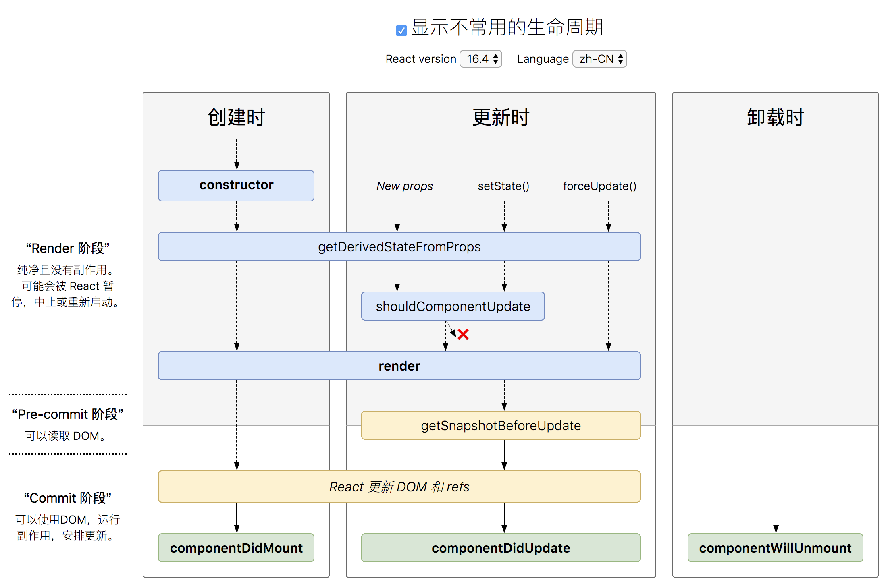

## React

* [React 生命周期](http://projects.wojtekmaj.pl/react-lifecycle-methods-diagram/)

* [官方文档](https://reactjs.org/docs/getting-started.html)
* [React 源码剖析系列 － 不可思议的 react diff](https://zhuanlan.zhihu.com/p/20346379)
* [深度剖析：如何实现一个 Virtual DOM 算法](https://github.com/livoras/blog/issues/13)
* [你不知道的Virtual DOM](https://segmentfault.com/a/1190000016129036)